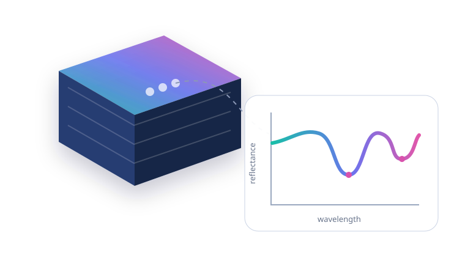

---
hide:
  - navigation
  - toc
---

  

    
Python interface · Tetracorder 6.00

    <h1>Material mapping from spectral tensors.</h1>
    

      Give Python reflectance values, wavelength coordinates, and a matching
      sensor profile. The wrapper handles the native cube workflow, container,
      temporary files, and result decoding.
    

    

      <a class="tc-button tc-button--primary" href="getting-started/quickstart/">Run a first spectrum</a>
      <a class="tc-button" href="concepts/hyperspectral-data/">Learn the concepts</a>
    

  

  

    
  

!!! info "About this documentation"

    These are unofficial working notes added in our fork for our Python and
    PSC workflow. We are not the authors of Tetracorder or of the original
    repository. The [upstream repository](https://github.com/PSI-edu/spectroscopy-tetracorder)
    and its README and tutorials remain the original project documentation.

  
<strong>1 → N dimensions</strong>Spectrum, batch, cube, or tensor

  
<strong>1 native run</strong>All spectra in one call

  
<strong>0 raw files</strong>Kept by default after decoding

## A thin Python layer, not a new classifier

`tetracorderpy` does not reimplement Tetracorder's expert system. It gives the
existing USGS Tetracorder 6.00a5 workflow a format-independent Python boundary:

  
<strong>Reflectance tensor</strong><small>NumPy-like values and metadata</small>

  
<strong>Sensor profile</strong><small>Sampling plus native dataset preset</small>

  
<strong>Tetracorder cube run</strong><small>One Apptainer/Singularity process</small>

  
<strong>Result tensors</strong><small>Materials, fit, depth, and decisions</small>

The abstraction stays Pythonic, while the scientific decisions remain those of
the selected native expert system and its convolved reference libraries.

## What you can pass

-   :material-chart-bell-curve-cumulative:{ .lg .middle } **One spectrum**

    ---

    A `(bands,)` reflectance vector becomes one native cube pixel. Results have
    shape `(decisions,)`.

    [:octicons-arrow-right-24: Quick start](getting-started/quickstart.md)

-   :material-view-grid-outline:{ .lg .middle } **A batch or image cube**

    ---

    Use `(n, bands)`, `(y, x, bands)`, or arbitrary leading dimensions. The
    wrapper preserves the leading sample shape.

    [:octicons-arrow-right-24: Tensor semantics](guides/tensors.md)

-   :material-file-table-outline:{ .lg .middle } **An ENVI raster**

    ---

    Read BIP, BIL, or BSQ data and common wavelength, FWHM, bad-band, scale,
    and deleted-value fields.

    [:octicons-arrow-right-24: ENVI adapter](data/envi.md)

-   :material-server-security:{ .lg .middle } **PSC's shared runtime**

    ---

    Install the Python package from Git and discover the shared SIF
    automatically. Build only when the shared image is unavailable.

    [:octicons-arrow-right-24: Installation](getting-started/installation.md)

## The important scientific boundary

!!! warning "A wavelength vector is necessary, but not sufficient"

    Tetracorder compares observations with reference spectra prepared for a
    particular instrument response. An arbitrary set of wavelength centers does
    not become scientifically supported merely because it fits in a NumPy
    array. The data must match a Tetracorder dataset preset and the corresponding
    convolved libraries.

Start with [sampling and sensor profiles](concepts/sampling-and-profiles.md) if
you are bringing data from a new instrument.
